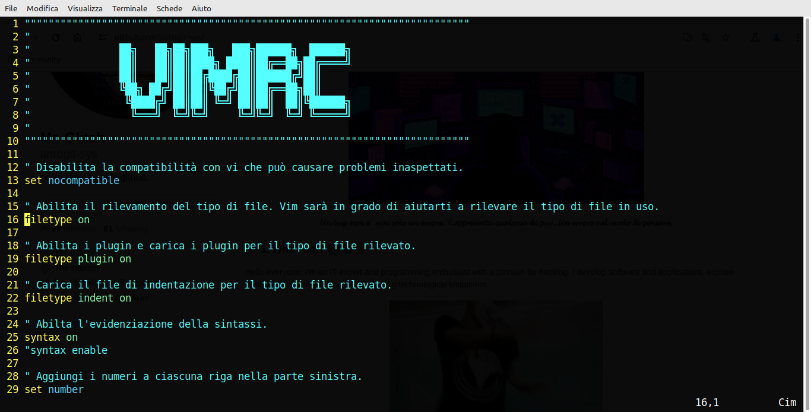

<h1 align = "center"> My .vimrc - glitch 2024</h1>
<h1 align = "center">
    
</h1>

Setting up Vim that I personally use

## Installation
1. clone the repository
 
```bash
git clone https://github.com/antogit-sys/vimrc-glitch-2024.git
```

2. go to vimrc-glitch-2024
 
```bash
cd vimrc-glitch-2024/
```

3. start setup
```bash
bash start-setup.sh
```

<h1 align="center"> *** HAPPY CODING !!! ***</h1>
